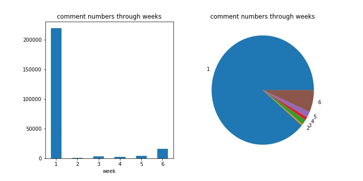
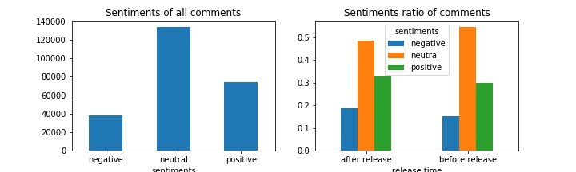
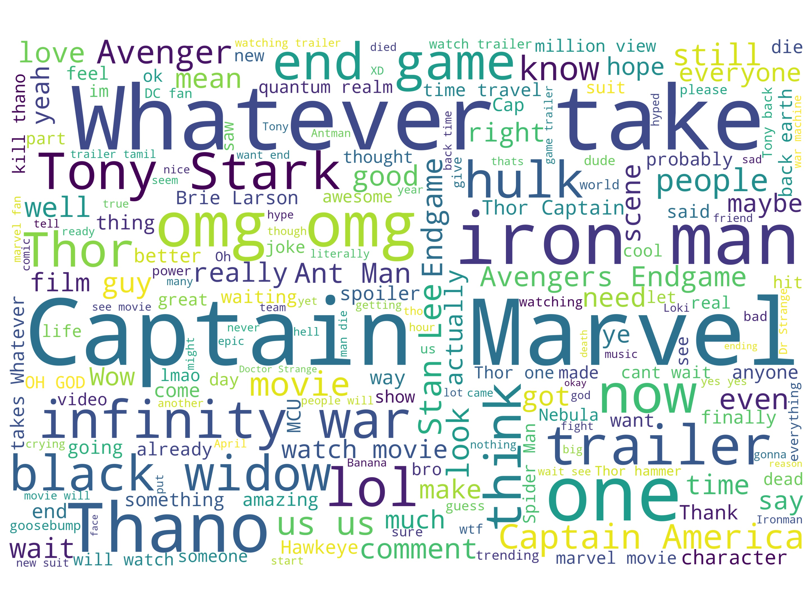
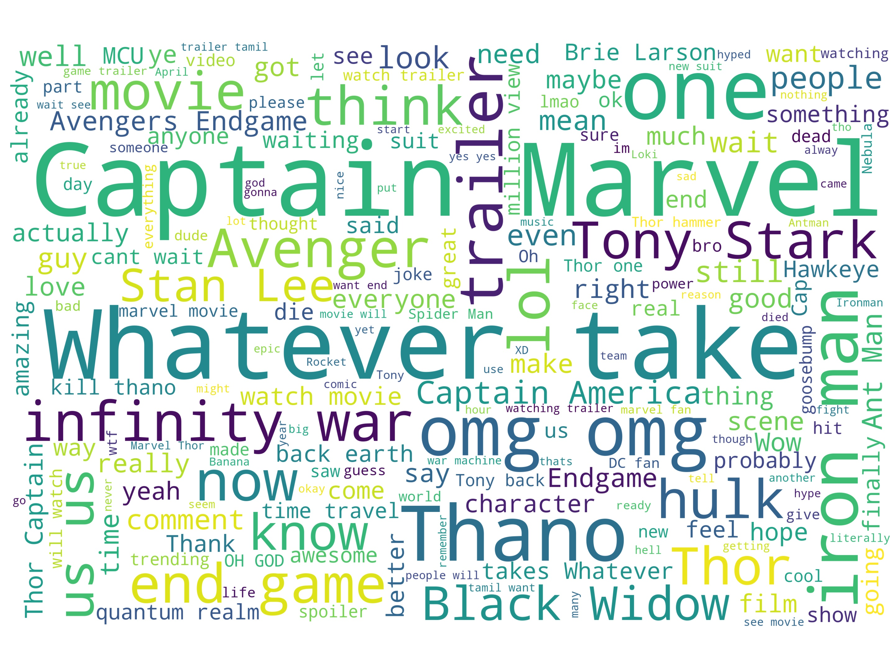
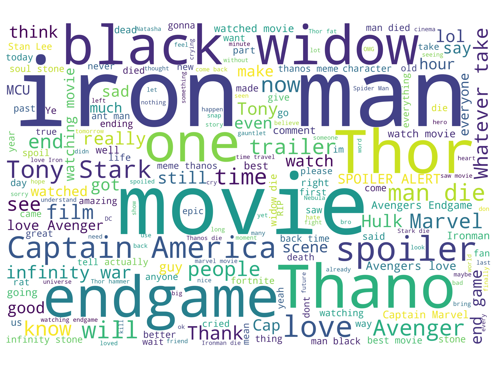
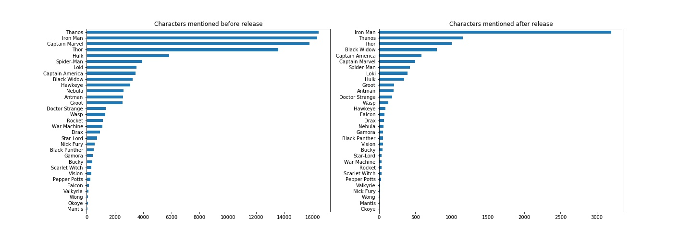

# 'Avengers 4: Endgame' Trailer Comment Analysis

'Avengers 4: Endgame', released in April 2019, is the 22th movie of the Marvel Universe, gathering the characters in the previous 21 movies, including Iron Man, Captain America, Thor, Hulk, ... The movie has gain lots of spotlights over the world, and is also approaching the box office of 'Avatar'. 

In this work, we analysis the youtube comments of the [Endgame Trailer](https://www.youtube.com/watch?v=TcMBFSGVi1c) on the first 6 weeks. We the effects of time and the characters on the amount, sentiment and the character popularity in the comments. Here's the outline: 

- [Amounts of Comments](#Amounts_of_Comments)
- [Sentiment Analysis](#Sentiment_Analysis)
- [Wordcloud](#Wordcloud)
- [Popularity of Characters](#Popularity_of_Characters)
- [Conclusion](#Conclusion)

## Amounts of Comments

There are around 247K comments on the first 6 weeks of the release of the trailer. Below shows the charts of the comment numbers through weeks (bar chart and pie chart).

From the distiribution of the comment numbers through weeks, we can see that during the first week of the release of the trailer, there are more than 200K comments, having around 89% of all the comments. This also reflects that the trailer has huge effect on Youtube in the first week compared to other weeks.  

During the sixth week, which is after the release of the movie, there are around 6.6% of comments, the second most large number of comments through week, also reflecting the release of the movie have impacts on the youtube comments, with the probability that the viewers come back to give some comments after watching the movie.

## Sentiment Analysis

Sentiment analysis are separated into three groups: negative, neutral and positive, and the time's effects are also analyzed (before and after the movie release). There are only 30% of comments having positive sentiments, with others being neutral and negative. 

This might be because that the dictionary for distinguishing the sentiment isn't enough to find out what really the sentiments the comments are trying to convey. In addition, there might be lots of emotion in the comments, not enough to convey with only three sentiment category. Also, Sad feelings can also be distinguished as negative, but this doesn't mean that the moive is bad!

## Wordcloud

The wordcloud of all comments, before the movie released, and after the movie released are shown and discussed below.

The figure above is the wordcloud of all the youtube comments. We can see that there are some words that frequently appeared:

- Movies
	- Infinity war
	- Endgame
	- Avenger
- Characters
	- Captain Marvel
	- Iron Man / Tony Stark
	- Thano(s)
	- Thor
	- Black widow
	- hulk
	- Captain America
	- Ant man
- Others
	- Whatever (it) take(s)
	- Stan Lee

Some of the biggest words are 'Captain Marvel', 'Whatever take', 'Iron man' and 'Thanos'. The reason that 'Captain Marvel' is mentioned a lot might be that the movie is latest Marvel movie and is also broadcasting at the time the trailer released. 'Whatever it takes' is the line in the movie, also representing the heros' mind on the war. 'Iron man' is the most classic and the first character in the movie, and the comments shown are also conveying its popularity among all the Mavel characters. As 'Thanos' is the enemy in the latest Avenger games, comments are also discussing a lot about the characters.  

   

The left figure is the wordcloud of the comments before the movie release, with the right being comments after release. We can see that there are big differences between the two figures. 

The left figure (before release) follows similar word-showing trend of the wordcloud of all comments, since that the comments before release have more than 90% of the comments. While after the movie release, the comments shown are discussing more different topics, with the biggest word shown in wordcloud being Iron Man, Black Widow, Thano, Thor, Captain America. Indeed, these characters are countering some important changes in the movie, and the audiences do have lots of emotions of what's happening on these characters.

## Popularity of Characters

'Avengers' is the movie series that gathers lots of Mavel characters, with each characters having appearence in different Marvel movies. 'Endgame' is the 22th film of the Marvel Universe, gathering previous characters in the previous 21 movies. We
take a look at the popularity of the characters in the Endgame trailer comments before the movie release and after the movie release.

The comments on the popularity are affected by the date, the movie itself, and the popularity of the characters. If we take a look at the top 5 characters in both figures, 'Thanos', 'Iron Man', 'Thor' are appearing both before and after the movie release. 'Black Widow' and 'Captain America' have more numbers of mentioned after the movie release, also reflecting how the movie goes.

## Conclusion

First week have 89% of comments. There are 30% positive comments in the sentiment analysis. The wordcloud and popularity of characters of the comments are affected by the movie release date, having some changes after the movie release.
